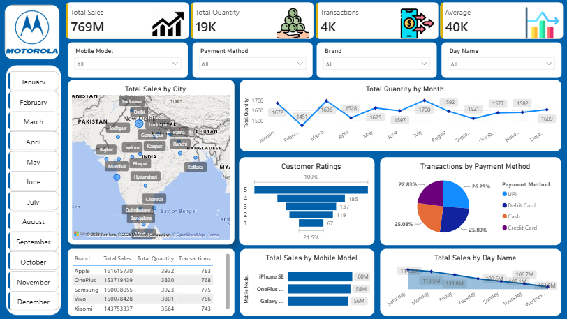

# Motorola Mobile Sales Dashboard | Power BI

## 📌 Project Overview
An interactive business intelligence dashboard built in Power BI to analyze Motorola mobile sales performance across regions, models, and time periods.

## 📊 Key Metrics Tracked
- 💰 Total Sales: ₹769M
- 📦 Total Quantity Sold: 19K Units
- 🧾 Total Transactions: 4K

## 🛠️ Tools Used
- Power BI Desktop
- Power Query (Data Cleaning & Transformation)
- DAX (Custom Measures)
- Microsoft Excel (Data Source)

## ✨ Dashboard Features
- KPI Cards for Sales, Quantity and Transactions
- Map Visual for region-wise sales distribution
- Bar Chart for mobile model-wise comparison
- Line Chart for monthly sales trend analysis
- Dynamic Slicers for filtering by time and region

## 📐 DAX Measures Used
- Total Sales = SUMX(Sales, Sales[Quantity] * Sales[Price])
- Average Order Value = DIVIDE([Total Sales], [Total Transactions])

## 📷 Dashboard Preview

